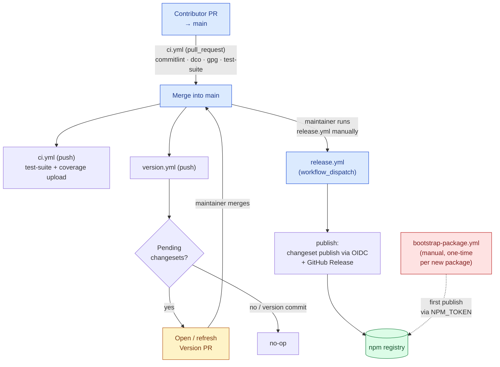

# Contributing to LazyConfig

Thanks for helping improve LazyConfig. This guide covers how to make changes that pass CI and get merged.

## Prerequisites

- Node.js `>=22` (CI tests against Node 22 and 24)
- pnpm `>=10`
- A GPG key configured for signing commits (see [Commit Signing](#commit-signing))

Linux and macOS are the supported development environments. Windows contributors should use WSL2.

```bash
pnpm install
pnpm build
pnpm test
pnpm lint
```

## Branching

Branch from `main` using lowercase hyphenated names with a type prefix:

```
feat/<short-description>
fix/<short-description>
docs/<short-description>
refactor/<short-description>
test/<short-description>
chore/<short-description>
```

## Commit Format

Use [Conventional Commits](https://www.conventionalcommits.org/en/v1.0.0/):

```
<type>(<optional-scope>): <short imperative summary>
```

Examples: `feat(cli): add compile types command`, `fix(jest): correct api-extractor entry path`.

## Commit Signing

Every commit must be both **GPG-signed** and **DCO-signed-off**. Both are enforced by CI.

### One-time setup

1. [Generate a GPG key](https://docs.github.com/en/authentication/managing-commit-signature-verification/generating-a-new-gpg-key) and [add it to GitHub](https://docs.github.com/en/authentication/managing-commit-signature-verification/adding-a-gpg-key-to-your-github-account).
2. Configure Git to sign by default:

   ```bash
   git config --global user.signingkey <YOUR_KEY_ID>
   git config --global commit.gpgsign true
   git config --global format.signOff true
   ```

   With these set, plain `git commit` produces commits that pass both checks.

### Per-commit (if you don't want global config)

```bash
git commit -S -s -m "feat(scope): summary"
```

`-S` adds the GPG signature, `-s` adds the `Signed-off-by` trailer.

### Fixing existing commits

To re-sign and add sign-off to every commit on your branch:

```bash
git rebase --exec 'git commit --amend --no-edit -S -s' main
```

## Changesets

LazyConfig uses [Changesets](https://github.com/changesets/changesets) for versioning and changelogs.

### When required

- **Required**: changes to source or public APIs of any package under `packages/`.
- **Not required**: internal tooling, CI config, tests-only changes, docs unrelated to public API behavior.

If unsure, add one. An extra changelog entry is harmless; a missing one is not.

### Creating a changeset

```bash
pnpm changeset
```

The prompt asks you to select affected packages, choose a bump level (`patch` / `minor` / `major`), and write a summary. The summary is written **for the people who will read the changelog later**, in the imperative mood:

- ✅ `Fix CLI crash when the config file is missing a default export.`
- ✅ `Add support for TypeScript 5.4 in the rollup preset.`
- ❌ `fix bug` / `update deps` / `address review comments`

Commit the resulting `.changeset/*.md` file alongside your code change.

### Bump level

Follow [Semantic Versioning](https://semver.org/):

| Change                                               | Bump    |
| ---------------------------------------------------- | ------- |
| Breaking API change (removed export, renamed option) | `major` |
| New feature, backward-compatible addition            | `minor` |
| Bug fix, perf, internal refactor with no API impact  | `patch` |

For `0.x` packages, treat `minor` as the breaking bump and `patch` as everything else — `0.x` versions carry no stability guarantee.

## Release Pipeline

Five workflows form one pipeline. In the normal flow you interact with two touch-points: opening your PR, and (for maintainers) running the release workflow to publish. Everything else is automatic.

- **`ci.yml`** — validates every PR and every push to `main`; branch protection requires it before any PR can land. Delegates build/lint/test to `test-suite.yml` and uploads coverage on pushes to `main` (so the Codecov badge updates after merge, not on open PRs).
- **`test-suite.yml`** — reusable workflow (`workflow_call`) holding the build + lint + test matrix (Node 22/24). Factored out so other workflows can reuse it.
- **`version.yml`** — on push to `main`, opens or updates the Version PR when pending changesets are detected.
- **`release.yml`** — publishes to npm via OIDC. Triggered manually via `workflow_dispatch` from the Actions UI; it does **not** run on push to `main`, so merging the Version PR never publishes by itself. A maintainer runs it to publish.
- **`bootstrap-package.yml`** — manual, one-time per new package (see [Adding a New Package](#adding-a-new-package)).



Merging the Version PR produces the version commit but publishes nothing. Publishing is a separate, deliberate step: after the Version PR is merged, a maintainer goes to **Actions → Release → "Run workflow"**, leaves the branch on `main`, and runs it. This publishes the tip of `main` — so make sure the Version PR merge is the latest commit on `main` before dispatching (no unrelated merge landed on top that you don't want released yet).

`pnpm changeset publish` publishes every package whose version isn't yet on npm and skips the rest; the per-package `<name>@<version>` tags and GitHub Releases are created by changesets during that publish.

### What `release.yml` checks before publishing

Before touching npm, the workflow verifies there is **something to publish** — at least one non-private package whose version isn't already on npm (checked via `npm view`). If everything is already published it aborts loudly, which catches the common mistake of dispatching before the Version PR was merged (changeset publish would otherwise exit green having done nothing). The workflow does not re-run tests — branch protection already validated `main`.

Who may publish is controlled by the dispatch itself: only users with write access can run a `workflow_dispatch`, and the `release` environment can require reviewers for an extra approval gate.

## Adding a New Package

npm's Trusted Publishers (OIDC) requires the package name to exist on the registry before OIDC can be configured. The first publish therefore has a separate, manual workflow:

1. Open a PR adding `packages/<name>/` with `"version": "0.0.0"` in `package.json`. No changeset needed yet.
2. After merge, a maintainer runs the **Bootstrap Package** workflow (`workflow_dispatch`) with the package name as input — `dry-run: true` first to verify the tarball, then `dry-run: false`.
3. The maintainer configures the Trusted Publisher on `npmjs.com` for the new package, pointing at `release.yml` and the `release` environment.
4. From the next release cycle on, the package follows the standard changeset flow: add a changeset, merge it, merge the Version PR, then run the release workflow to publish (see [Release Pipeline](#release-pipeline)).

If you're proposing a new package, you don't need to do this yourself — a maintainer handles the bootstrap after the PR merges.

## Workflow Changes

If your PR touches `.github/workflows/` or `.github/actions/`, every third-party action reference must be pinned to a full commit SHA. Mutable tags (`@v4`, `@main`) are rejected.

### Why

Tags in GitHub Actions are mutable: maintainers can re-point `@v4` to new code at any time, and your workflow will execute it with no diff in your repo. SHA pinning makes the version explicit and stops a compromised upstream from silently affecting CI.

### How

Use [`pin-github-action`](https://github.com/mheap/pin-github-action) to convert automatically:

```bash
npx pin-github-action@3.4.0 --recursive .github/workflows/
```

It rewrites `uses: owner/repo@tag` to `uses: owner/repo@<sha> # tag`, preserving the tag as a comment. Result:

```yaml
- uses: actions/checkout@de0fac2e4500dabe0009e67214ff5f5447ce83dd # v6
```

**Exceptions** — these don't need pinning:

- Composite actions inside this repo (`uses: ./.github/actions/node-setup`).
- Reusable workflows inside this repo (`uses: ./.github/workflows/test-suite.yml`).

## Pull Requests

Before opening:

- [ ] Branch is up to date with `main`
- [ ] `pnpm build && pnpm test && pnpm lint` pass locally
- [ ] Commits are GPG-signed and DCO-signed-off
- [ ] Changeset added (if the PR affects a published package)
- [ ] Workflow actions pinned to SHAs (if you touched `.github/`)

In the PR description:

- Target `main`.
- Summarize what changed and why.
- Link related issues (`Closes #123`).
- Update docs when behavior or APIs change.

Draft PRs are encouraged for early feedback.

## Reporting and Discussion

- Questions and ideas: https://github.com/ruben-omh/lazyconfig/discussions
- Bugs and feature requests: https://github.com/ruben-omh/lazyconfig/issues
